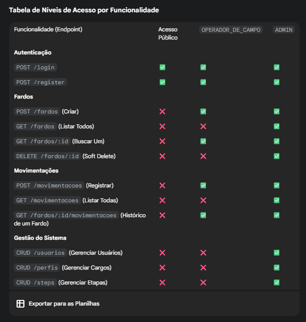

# cotton_counter
Repositório para desenvolvimento do projeto Contador de Algodão

npm i jsonwebtoken
npm i -D @types/jsonwebtoken

npm i bcrypt
npm i -D @types/bcrypt

npm i pg
npm i --save-dev @types/pg
npm install dotenv

npm i express
npm i -D typescript ts-node @types/node @types/express @types/cors

npm i qrcode

na verdade vcs podem só dar 'npm i' q já resolve tudo

Vou documentar aqui de maneira informal mas só para não perder o raciocinio

o auth ta feito, só falta fazer os endpoint e colocar o middleware com [] nas rotas

Service do movimentation tbm está pronto, ele cria instacias privadas só para uso própio, talvez seria mais fácil usar const, mas quis inovar e acho q amplia meu aprendizado, ai tem q validar todos os parametros que são utilizados para criar a movimentacao no repository, por isso foi criada 3 instacias

